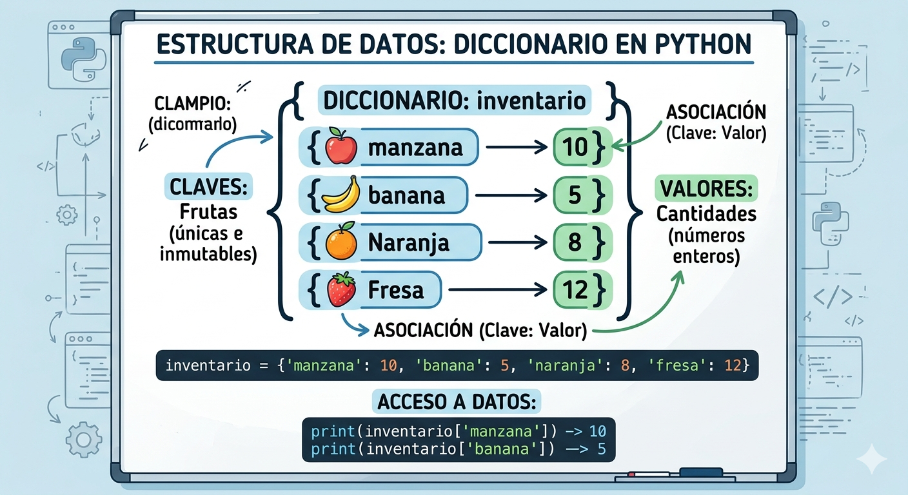

# DICCIONARIO EN PYTHON
Conceptos y ejercicios de diccionarios en pyhton

- Los diccionarios son datos estructurados, hacen referencia a una coleccion de datos
- Son una coleccion desordenada de pares de datos de la forma **clave**:valor, conocidos como elementos o items.
- Son mutables, una vez definidos se le pueden agregr nuevos elementos, modificar o eliminar algunos de los que y tiene
- tambien son conocidos como arrreglos asociativos.

## REPRESENTACION GRAFICA DE UN DICCIONARIO



## SINTAXIS 

`nombre_diccionario = {clave1:valor1, clave2:valor2,...}`

- Cada item o elemento tiene la forma **CLAVE:VALOR**
- En cada item hay una clave y uno o mas valores. Si se desconoce el valor se puede completar con *NONE*
- Los elementos del diccionario se indexan por clave
- Las claves solo pueden ser datos inmutables 
- Los valores pueden ser datos mutables o inmutables 
- Las claves no pueden repetirse dentro de un diccionario 

### EJEMPLO 

`frutas = {"manzana":34,"pera":45}`

## OPERACIONES 

### AGREGAR ELEMENTOS 

`nombre_diccionario[clave] = valor`

`frutas["cereza"]=90`

### CONSULTAR O MODIFICAR ELEMENTOS

`print("el valor de pera es: ",frutas["pera"])`

### ELIMINAR ELEMENTOS

`del frutas["pera"]`

### OPERADOR DE PERTENENCIA

``` Python 
if "cereza" in frutas:
    print("Si esta cereza en el diccionario")
else:
    print("No esta cereza en el diccionario")
```

## EJERCICIO
- Cree un programa en pthon que utilice un diccionario para guardar los nombres de sus amigos y su telefono. En este caso, el diccionario representa una agenda telefonica.  El programa pedira nombres y telefonos  y los ira guardando ( los nombres en mayuscula).  Ademas, el programa debe permitir consultar o eliminar un telefono. Incluya un menu de opciones 
